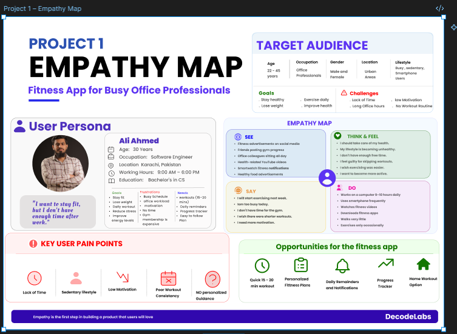

# Project 1 - Fitness App Empathy Map

This project was created as part of my DecodeLabs UI/UX Internship.

## Project Overview

The goal of this project was to create an empathy map for a fitness app designed for busy office professionals. The empathy map focuses on understanding user needs, goals, frustrations, and behaviors to improve the user experience.

## Preview

## PDF

[View Project PDF](./decode%20lab%20-%20Project%201.pdf)

## Figma Design

[Open in Figma](https://www.figma.com/design/DQKU6qhrx4sd0uql0SD3xq/project-1_DECODE-LAB?node-id=122-1767&t=pcDcZ9mW27GqwbCI-1)

## Tools Used

- Figma
- User Research
- Empathy Mapping

## Created By

**Gittiqa Maheshwari**
